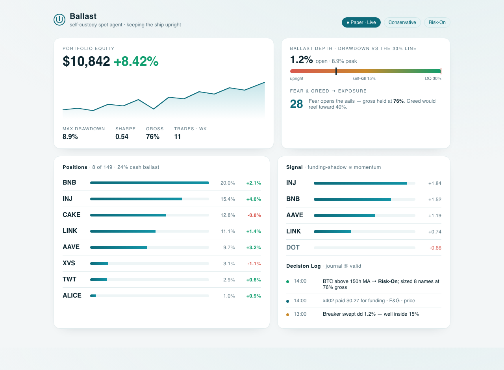
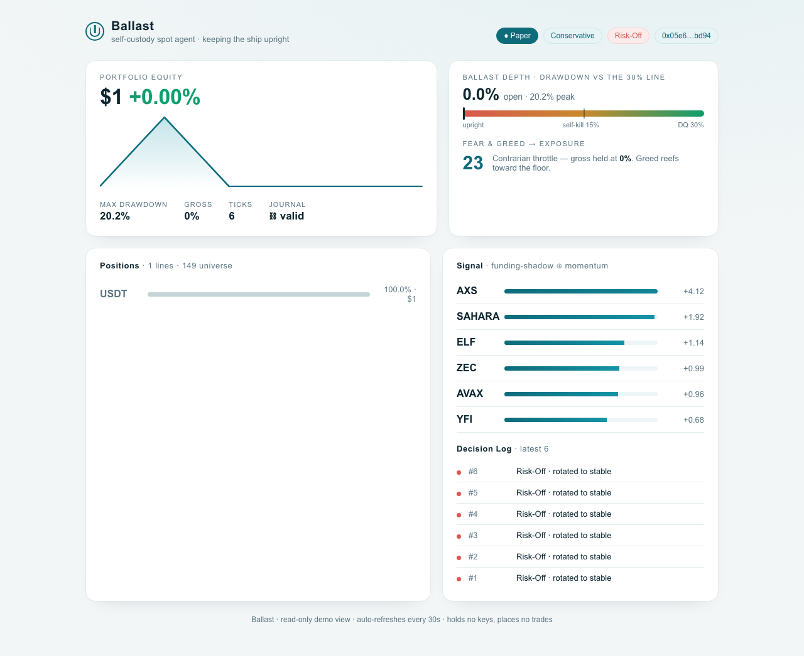

# Ballast: self-custody spot agent that survives the drawdown gate

A spot-only autonomous trading agent on BNB Chain that reads where leverage is about to break, then positions in spot before the cascade, wrapped in a risk overlay built to not blow up.

[](https://www.python.org/)
[](https://trustwallet.com/)
[](https://www.bnbchain.org/)
[](LICENSE)
[]()



Built for **BNB Hack: AI Trading Agent Edition** (CoinMarketCap, Trust Wallet, BNB Chain).

---

## What Is Ballast?

Ballast trades a fixed universe of BEP-20 tokens on BSC, once per hour, fully autonomously and self-custody. It uses derivatives data (funding rate, open interest) as a signal for where leverage is overcrowded, then takes spot positions ahead of the unwind. A survival-first risk overlay keeps it inside the competition's 30 percent max-drawdown disqualifier.

The thesis rests on two facts:

1. **The sanctioned stack is spot-only.** Trust Wallet Agent Kit (TWAK) does swaps, not perps. So Ballast uses derivatives data as a signal for spot execution, trading the leverage crowd's unwind without ever holding leverage.
2. **This contest is won by the risk overlay, not the alpha.** Ranking is on live PnL with a hard 30 percent drawdown cut. Naked momentum agents breach it. Ballast's overlay is the product: it survives the gate while flashier agents capsize. Hence the name. Ballast keeps the ship upright.

---

## Screenshots

| Live read-only dashboard | The decision loop on real data |
|---|---|
|  |  |

---

## Features

- **Funding-shadow signal.** Deeply negative funding means crowded shorts and short-squeeze fuel, bullish for a spot long entered before the cascade. Rising open interest amplifies conviction.
- **Survival-first risk overlay.** Inverse-volatility sizing, a per-token weight cap with redistribution, a contrarian Fear and Greed exposure throttle, and a BTC moving-average regime kill-switch.
- **Independent circuit-breaker.** A separate clock flattens to stablecoin and pauses the loop the moment drawdown hits the internal self-kill, set well inside the 30 percent line.
- **Gasless execution.** Swaps route through the MegaFuel paymaster, so the agent competes with tiny capital. Verified on-chain: a real swap paid zero gas.
- **Verifiable journal.** Every decision is recorded under an ERC-8004 identity in a hash-chained, tamper-evident log that can fail without halting trading.
- **One engine, many personalities.** A config layer toggles signals and selects a Conservative or Aggressive risk preset.

---

## Tech Stack

| Layer | Technology |
|-------|-----------|
| Language | Python 3.11 |
| Execution and signing | Trust Wallet Agent Kit (`twak` CLI), self-custody, gasless via MegaFuel |
| Identity and payments | BNB AI Agent SDK (`bnbagent`): ERC-8004 + x402 |
| Market data | Binance public futures (funding, open interest), spot ticker, alternative.me Fear and Greed |
| Chain | BSC mainnet |
| Dashboard | Flask, read-only |
| Tests | pytest (42 passing) |

---

## How It Works

One decision loop, once per hour, over the 149-token universe:

```
1 PERCEIVE   live funding/open-interest, Fear & Greed, price/vol, BTC
2 REGIME     BTC at or below its 150h MA?  rotate to stablecoin, stop
3 SIGNAL     rank tokens: funding-shadow blended with momentum
4 THROTTLE   Fear & Greed sets gross (40-100%); inverse-vol sizes, caps per token
5 EXECUTE    diff vs current; TWAK signs and swaps the deltas (self-custody, gasless)
6 RECORD     decision + rationale to a hash-chained journal under ERC-8004 identity
```

A second clock runs the breaker:

```
        +------- main clock (hourly) -------------+
        | perceive > regime > signal > size > exec > record |
        +-------------------------------------------+
        +---- breaker clock (minutes, own thread) ----+
        |  drawdown at self-kill?  flatten + pause      |
        +-----------------------------------------------+
                       shared, lock-guarded portfolio state
```

---

## Running Locally

```bash
git clone https://github.com/ajanaku1/ballast.git
cd ballast
uv venv --python 3.11 && uv pip install -e .
cp .env.example .env            # paper mode by default; no keys needed offline

python -m scripts.run --ticks 3 # one autonomous loop, paper mode, prints each tick
python -m backtest.backtest     # the drawdown gate (must pass before live)
python -m dashboard.app         # read-only dashboard at http://127.0.0.1:8088
pytest -q                       # the risk overlay and breaker are tested first
```

### Modes

- **paper** (default): simulated fills, no chain, deterministic synthetic data offline.
- **dry_run**: builds real swap intents and quotes them, does not broadcast (needs `twak`).
- **live**: broadcasts signed gasless spot swaps on BSC (needs `twak` and a funded wallet).

### Live competition runner

`scripts/compete.py` runs one self-contained live tick: it reads real balances from chain, runs the breaker check, decides, executes gasless swaps, and persists state. A launchd job (`scripts/com.ballast.agent.plist`) runs it hourly.

---

## Risk Overlay

This is the product. It is built test-first and validated by a backtest gate that requires max drawdown under 25 percent before any live wiring.

| Control | What it does |
|---|---|
| Inverse-vol sizing | calmer names carry more weight; one token cannot dominate |
| Per-token cap | a hard ceiling, excess redistributed to uncapped names |
| Fear and Greed throttle | contrarian gross 40-100 percent; cuts risk into euphoria |
| BTC regime gate | flattens to stable when BTC is at or below its 150h MA |
| Drawdown breaker | independent clock; flattens and pauses at the self-kill, inside 30 percent |

Backtest on synthetic stress including a leverage cascade: Conservative +7.2 percent at 8.9 percent max drawdown, Aggressive +8.6 percent at 9.6 percent. Both clear the margin.

---

## Project Structure

```
ballast/
  config.py        presets, signal toggles, thin-capital tuning
  loop.py          the 6-stage tick orchestrator + breaker wiring
  perceive.py      stage 1: market data (live or x402)
  regime.py        stage 2: BTC moving-average regime gate
  signals/         stage 3: funding_shadow, momentum, blend, fear_greed throttle
  strategy.py      stages 3+4 orchestration (shared by loop and backtest)
  risk.py          stage 4: inverse-vol sizing, per-token cap + redistribution
  breaker.py       independent drawdown circuit-breaker (own clock)
  execute.py       stage 5: TWAK swap execution (self-custody)
  journal.py       stage 6: hash-chained journal (fail-safe)
  bnb_client.py    BNB AI Agent SDK: ERC-8004 identity + x402 signing
  twak_client.py   TWAK wrapper (paper / dry-run / live), symbol resolver
  market_data.py   live funding/OI/price/F&G client
backtest/          the gate: prove max drawdown under cap before live
dashboard/         read-only demo view (Keel direction)
skill/SKILL.md     the strategy as a CoinMarketCap skill spec
scripts/           run, compete (live tick), register, rehearse, scheduler
tests/             risk overlay, breaker, signals, regime, execute, backtest, SDK
```

---

## Safety and Scope

- Spot only. No perps, leverage, shorting, pairs, or carry. Derivatives data is a signal, never a position.
- Self-custody. Signing via TWAK and OS keychain. No private keys in this repo.
- Journaling is fail-safe. The identity and journal layer can fail without halting the trade loop.

---

## License

MIT
